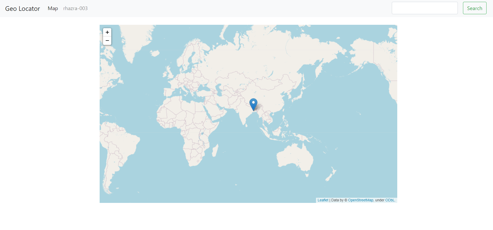
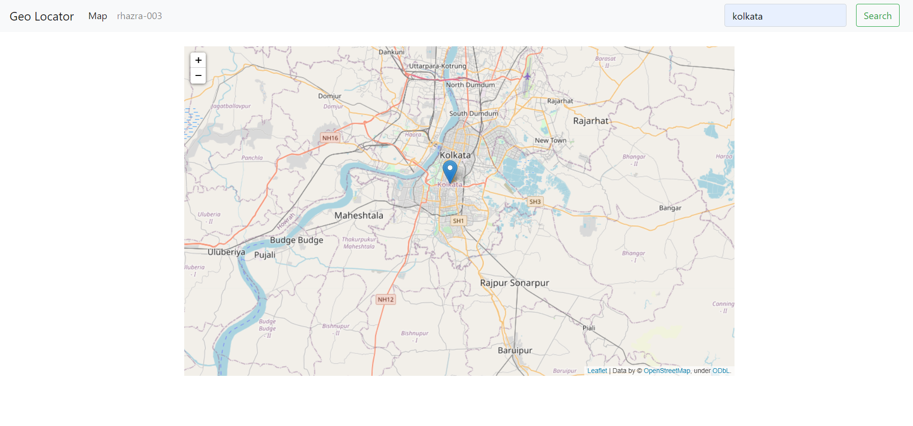
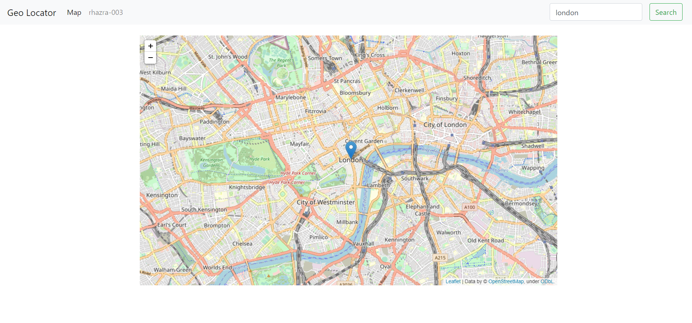

## Geo_Locator

### This is a Django Web Application that enables a user to search for a Location and find same on a Map. Made using Django Web Framework, integrated django with the Folium and Geocoder Python package.

### Home Page

 

### Kolkata

 

### London

